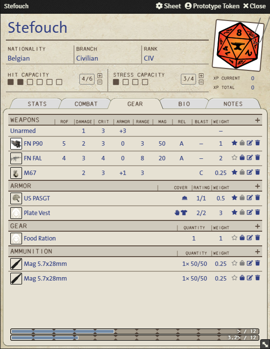
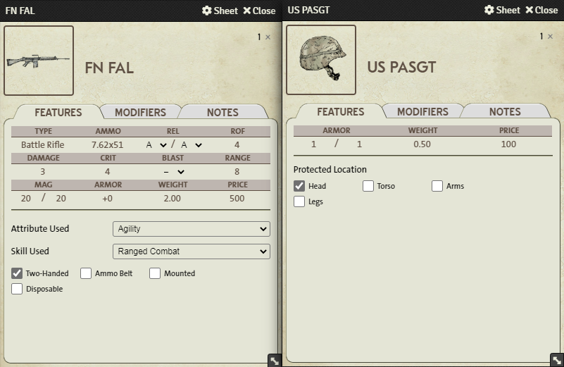

<h1 align="center"><b>Twilight: 2000</b> 4th Edition <small>🎲 <i>Foundry VTT</i> 🎲</small></h1>

  
  
  
  
  
  

> A system for Twilight 2000 4E (Free League Publishing) on Foundry VTT.

  

# Install

1. Go to the setup page and choose Game Systems.

2. Click the Install System button, and paste in this [manifest link](https://raw.githubusercontent.com/stefouch/t2k4e/master/system.json).

3. Create a Game World using the Twilight 2000 4E system.

# Supported Languages
- English

# Supported Modules
*Nihil*

# Previews

  

# Planned Features
- **Vehicle Sheet**
- **Dice So Nice support**
- Animal (NPC) Sheet
- Weapon ammo consumption, reload, etc.
- More automation
- Crits (if able)
- Party Sheet (for travel)

# 🤝 Contributing

Contributions, issues and feature requests are welcome! Feel free to check the [issues page](https://github.com/Stefouch/t2k4e/issues).

# Author

  

### 👤 Stefouch

* **Twitter:** [@stefouch](https://twitter.com/stefouch)
* **Github:** [@Stefouch](https://github.com/Stefouch)
* **Discord:** Stefouch#5202
  * [Year Zero Worlds](https://discord.gg/RnaydHR)
  * [The Foundry](https://discord.gg/8yAKUHZZKE)

# 🙏 Show Your Support

Give a ⭐️ if this project helped you!

# List of Changes

See the [changelog](https://github.com/Stefouch/t2k4e/blob/master/CHANGELOG.md#changelog) for a complete list of changes applied to the system since 2021.

# 📝 License

Copyright © 2021 [Stefouch](https://github.com/Stefouch). 
This project JavaScript code is [MIT](https://github.com/Stefouch/t2k4e/blob/master/LICENSE) licensed.