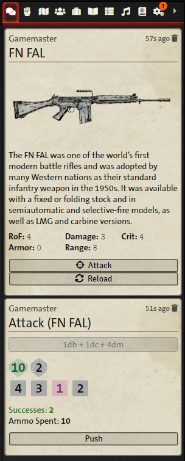

<h1 align="center"><b>Twilight: 2000</b><br/>4<sup>th</sup> Edition<br/><small>🎲 <i>Foundry VTT</i> 🎲</small></h1>
<p align="center">
  
  <a href="https://foundryvtt.com" target="_blank">
    
  </a>
  <a href="https://foundryvtt.com/packages/t2k4e/" target="_blank">
    
  </a>
  <a href="https://github.com/fvtt-fria-ligan/twilight2000-foundry-vtt/releases">
    
  </a>
  <a href="https://github.com/fvtt-fria-ligan/twilight2000-foundry-vtt/graphs/commit-activity" target="_blank">
    
  </a>
  <a href="https://github.com/fvtt-fria-ligan/twilight2000-foundry-vtt/blob/master/LICENSE" target="_blank">
    
  </a>
  <a href="https://www.patreon.com/Stefouch">
    
  </a>
  <a href="https://twitter.com/freeleaguepub" target="_blank">
    
  </a>
  <a href="https://twitter.com/stefouch" target="_blank">
    
  </a>
</p>

The **OFFICIAL** game system for [Twilight 2000 (4th Edition)](https://freeleaguepublishing.com/en/games/twilight-2000/) on Foundry VTT.

<p align="center">
  <a href="https://frialigan.se/en/games/twilight-2000/" target="_blank">
    
  </a>
</p>

# 🚀 Install

1. Go to the setup page and choose Game Systems.

2. Click the Install System button, and paste in this manifest link:
```
https://raw.githubusercontent.com/stefouch/t2k4e/master/system.json
```

3. Create a Game World using the Twilight 2000 (4th Edition) system.

4. Read the [Wiki](https://github.com/fvtt-fria-ligan/twilight2000-foundry-vtt/wiki)!

# 🧩 Supported Modules

We highly recommend the following modules to play the game:

- [Dice So Nice!](https://foundryvtt.com/packages/dice-so-nice) – Will give you beautiful 3D dice for each roll.

- [Reverse Initiative Order](https://foundryvtt.com/packages/reverse-initiative-order) – Lets you reverse the initiative order in the combat tracker and add non-actor combat tokens (good for multiple initiatives).

- [Year Zero Actions](https://foundryvtt.com/packages/alien-actions) – For a better overview of what actions have been taken in combat.

# 💬 Supported Languages

- English
- French
- Swedish 

You may help localize the game system in your language by translating the [language file](./lang/en.json).<br/>
Head over the [GitLocalize page](https://gitlocalize.com/repo/7035) to start translating.

# 🖼️ Previews

  



# 🛠️ Contributing

Contributions, issues and feature requests are welcome!<br/>Feel free to check the [issues page](https://github.com/fvtt-fria-ligan/twilight2000-foundry-vtt/issues).

### Top Contributors

[@aMediocreDad](https://github.com/aMediocreDad) - Lots of code samples come from this artist.<br/>
[@Kayne](https://github.com/Kayne) - Fixed dice modifiers.<br/>
[@tinwe](https://github.com/tinwe) - Swedish translation & bugfixes.

# 👤 Author

<p align="center">
  <a href="https://stefouch.be" target="_blank">
    
  </a>
  <br/>
  <i>Built by a fan, for the fans.</i>
</p>

### Stefouch

- **Twitter:** [@stefouch](https://twitter.com/stefouch)
- **Github:** [@Stefouch](https://github.com/Stefouch)
- **Discord:** Stefouch#5202
  - [Year Zero Worlds](https://discord.gg/RnaydHR)
  - [The Foundry](https://discord.gg/8yAKUHZZKE)

# 📜 List of Changes

See the [changelog](https://github.com/fvtt-fria-ligan/twilight2000-foundry-vtt/blob/master/CHANGELOG.md#changelog) for a complete list of changes applied to the system since 2021.

# 📝 Licenses

- **Content & Logo:** [Twilight 2000 (4th Edition)](https://freeleaguepublishing.com/en/store/?collection_id=270655783061) is ™ & © 2021 GDW and Fria Ligan AB. All rights reserved. The parts of this project protected under this copyright may not be distributed commercially or freely. This includes art, logo, and copyright text.
- **Source Code:** All source code *(javascript, hbs, less, as well as system templates and the like)* are Copyright © 2021-2022 [Stefouch](https://github.com/Stefouch), and licenced under the [GNU General Public License v3.0](https://github.com/fvtt-fria-ligan/twilight2000-foundry-vtt/blob/master/LICENSE).
- **Foundry VTT:** The project is created following the Foundry VTT [Limited License Agreement for module development](https://foundryvtt.com/article/license/).
- **Icons:** Icons in the `module/t2k4e-coreset/assets/icons/` folder are courtesy of [Game-icons.net](https://game-icons.net/) and licenced under [CC BY 3.0](https://creativecommons.org/licenses/by/3.0/).
- **Fonts:** The fonts used in this project carry their own licences:
  - [Daisy Wheel](https://www.dafont.com/daisy-wheel.font)
  - [Blue Highway](https://typodermicfonts.com/blue-highway-5-0/)
  - [Mukta](https://fonts.google.com/specimen/Mukta)
  - [Nunito Sans](https://fonts.google.com/specimen/Nunito+Sans)
